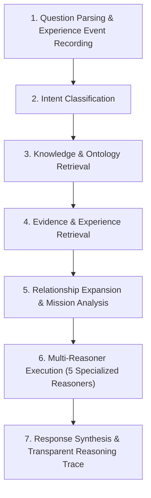

# Cognitive Core Architecture

## System Overview
The **Cognitive Core** forms the permanent architectural foundation of DEVAN as an **Engineering Cognitive Operating System**. It consists of three primary subsystems:

1. **Ontology Engine** (`src/lib/ontology/`): Central domain model and single source of truth for entity definitions and relationships.
2. **Experience Engine** (`src/lib/experience/`): Append-only immutable historical event logger. Competencies evolve dynamically from experience history.
3. **Mission Engine** (`src/lib/mission/`): Declarative goal evaluation engine computing progress over ontology entities, competencies, evidence, and experience events.

```
React (UI / Presentation Only)
  │
  ▼
API Client (Typed Singletons: reasoningClient, eyeClient)
  │
  ▼
API Routes (Thin Controllers: /api/reasoning, /api/eye)
  │
  ▼
Services (IntelligenceService, IntelligenceSnapshotService)
  │
  ├───────► Specialized Reasoners (Learning, Knowledge, Evidence, Experiment, Career)
  │
  ├───────► Cognitive Core Subsystems:
  │           ├── Ontology Engine (Single Source of Truth)
  │           ├── Experience Engine (Immutable Events)
  │           └── Mission Engine (Declarative Progress)
  │
  ▼
Repositories (CompetencyRepository, ExperienceRepository, SearchRepository, GraphRepository)
  │
  ▼
Prisma 7 ORM
  │
  ▼
PostgreSQL Database (Supabase)
```

## Immutable Architecture Principles (UJ.OS Constitution v1)
1. **Ontology Single Source of Truth**: No subsystem owns duplicate relationships. Everything operates directly on ontology entities.
2. **Experience is Immutable**: Experience events are append-only. History is never overwritten. Competencies derive from accumulated experience.
3. **Intelligence is Computed**: Reasoning results are never persisted; they are computed dynamically over Ontology, Experience, Evidence, Mission, and Context.
4. **Mission is Declarative**: Progress is computed dynamically over ontology relationships, competencies, evidence, repositories, and projects.
5. **UI is Presentation Only**: Contains zero business logic or relationship ownership.
6. **Repository Ownership**: Repositories own persistence. Repositories never call other repositories; services never perform direct database queries.
7. **Independent Testability**: All components remain isolated and unit-testable.
8. **Event-First Architecture**: Record an engineering event (`ExperienceEvent`) instead of mutating state wherever possible.
9. **Mandatory Documentation**: Every subsystem includes Purpose, Responsibilities, Dependencies, Public API, Sequence Diagrams, and Extension Points.
10. **Backwards Compatibility**: Extend, never replace.

## 7-Stage Reasoning Pipeline Flow

