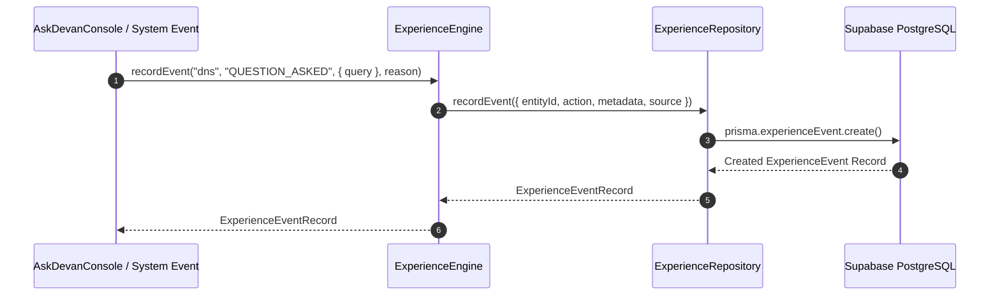

# Experience Engine Architecture

## Purpose
The **Experience Engine** (`src/lib/experience/`) acts as DEVAN's append-only immutable engineering record. Per UJ.OS Constitution Principle 2, experience is immutable and never overwritten. Competency readiness scores evolve dynamically from accumulated historical experience events.

## Responsibilities
- Record immutable `ExperienceEvent` entries (`timestamp`, `entityId`, `action`, `metadata`, `reason`, `source`, `confidence`).
- Provide chronological event timelines per entity and system-wide.
- Compute evolved 4-dimension readiness competencies (`Knowledge`, `Experience`, `Evidence`, `Confidence`) dynamically from historical event data.

## Dependencies
- `ExperienceRepository` (`src/repositories/experience.repository.ts`)
- `PrismaClient` & PostgreSQL `ExperienceEvent` table.
- `OntologyEngine` (`src/lib/ontology/`)

## Public API
- `recordEvent(entityId, action, metadata, reason, source, confidence): Promise<ExperienceEventRecord | null>`
- `getEventHistory(entityId: string): Promise<ExperienceEventRecord[]>`
- `computeEvolvedCompetency(conceptSlug: string): Promise<EvolvedCompetency>`
- `getRecentTimeline(limit?: number): Promise<ExperienceEventRecord[]>`

## Sequence Diagram

## Extension Points
- **Automated Evidence Verification Listeners**: Hook CI/CD webhooks (GitHub Actions, Vitest test runners) into `recordEvent()` to auto-record verification events.
