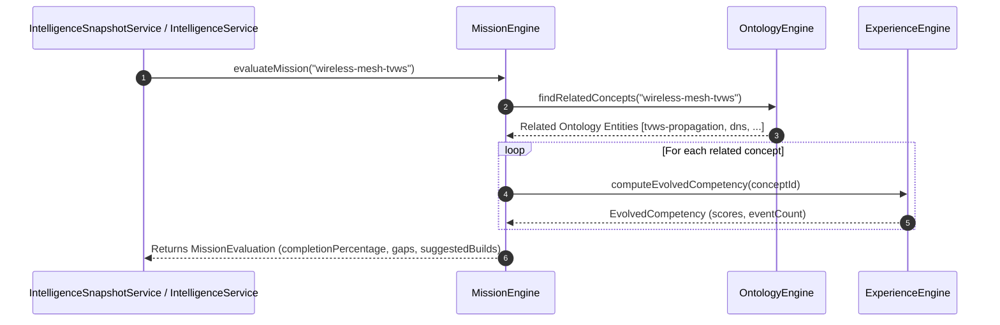

# Mission Engine Architecture

## Purpose
The **Mission Engine** (`src/lib/mission/`) provides declarative engineering goal evaluation. Per UJ.OS Constitution Principle 4, a Mission never stores progress directly; progress is computed dynamically over ontology entities, evidence, competencies, and experience history.

## Responsibilities
- Evaluate completion percentage for active missions.
- Audit required vs. actual competency levels across ontology entities.
- Identify remaining engineering gaps and generate recommended next builds.

## Dependencies
- `OntologyEngine` (`src/lib/ontology/`)
- `ExperienceEngine` (`src/lib/experience/`)
- `SearchRepository` (`src/repositories/search.repository.ts`)

## Public API
- `evaluateMission(missionSlug: string): Promise<MissionEvaluation>`
- `getCompletionPercentage(missionSlug: string): Promise<number>`
- `findRemainingGaps(missionSlug: string): Promise<MissionGap[]>`
- `suggestNextBuilds(missionSlug: string): Promise<string[]>`

## Sequence Diagram

## Extension Points
- **Custom Goal Matrices**: Define declarative milestone criteria for external role profiles (e.g. *Platform Engineering Roadmap*).
