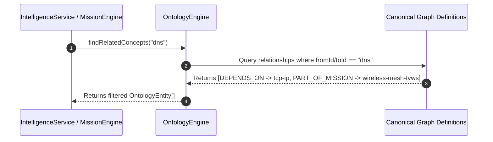

# Ontology Engine Architecture

## Purpose
The **Ontology Engine** (`src/lib/ontology/`) is the central domain model and single source of truth for all entities and relationships in DEVAN. No other subsystem owns duplicate relationship representations; all intelligence, mission, experience, and reasoning services compute directly over the ontology.

## Responsibilities
- Maintain canonical ICT engineering entity registry (Concepts, Projects, Experiments, Repositories, Missions, RFCs).
- Own relationship definitions (`DEPENDS_ON`, `PREREQUISITE_FOR`, `RELATED_TO`, `IMPLEMENTED_BY`, `EVIDENCE_FOR`, `PART_OF_MISSION`).
- Provide topological graph traversal, prerequisite chain expansion, and career profile alignment.
- Execute relationship inference over 2-hop graph paths.

## Dependencies
- Canonical taxonomy graph definitions (`ontology-graph.ts`).
- Fully UI-agnostic. Contains zero presentation logic.

## Public API
- `getEntity(entityId: string): OntologyEntity | undefined`
- `getAllEntities(): OntologyEntity[]`
- `findRelatedConcepts(entityId: string): OntologyEntity[]`
- `findPrerequisites(entityId: string): OntologyEntity[]`
- `findDependents(entityId: string): OntologyEntity[]`
- `getDependencyChain(entityId: string): DependencyChain`
- `findCareerConnections(role: string): OntologyEntity[]`
- `expandKnowledgeGraph(rootEntityIds: string[]): ExpandedNeighborhood[]`
- `inferRelationships(fromId: string, toId: string): OntologyRelationship | null`

## Sequence Diagram

## Extension Points
- **Dynamic Network Graph Import**: Extend `OntologyGraph` to hydrate external RDF/OWL or JSON-LD graph exports.
- **Weighted Relevance Scoring**: Adjust relationship weights dynamically based on evidence depth.
