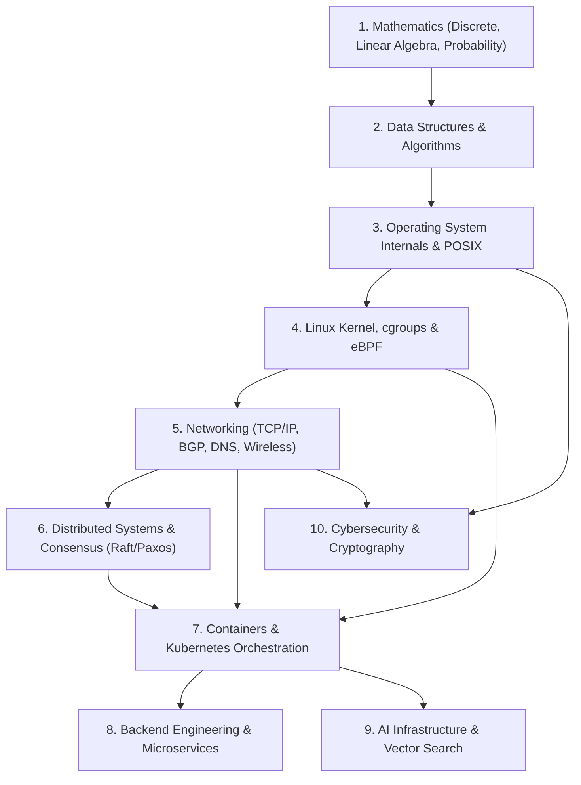

# DEVAN OS — Master Knowledge Import Plan & Canonical Domain Specifications (Phase VIII)

> **North Star Objective**: Operationalize the Knowledge Governance System to transform DEVAN OS from an architectural kernel into a 3,000–5,000 concept Engineering Knowledge & Intelligence Platform.

---

## 1. Import Strategy & Priority Matrix

The knowledge population strategy is structured into **Independent Ingestion Bundles** processed through the 10-stage `KnowledgeGovernanceSystem`. Each bundle generates an auditable `ReviewPackage` requiring human review before generating an `OntologyCommit` and version increment.

| Priority Tier | Bundle Name | Target Concept Count | Target Relationship Count | Target Evidence Anchors | Primary Ingestion Sources |
|---|---|---|---|---|---|
| **Tier 1 (Foundation)** | **Mathematics & Computer Science Fundamentals** | 350 | 700 | 50 | Academic Syllabi, Core Textbooks, Algorithm Benchmarks |
| **Tier 2 (Core Systems)** | **Operating Systems & Linux Kernel** | 450 | 1,000 | 120 | Linux Kernel Docs, Man Pages, POSIX Specs, eBPF Traces |
| **Tier 3 (Reference)** | **Networking & Wireless Communications** | 500 | 1,200 | 150 | IETF RFCs, Wireshark PCAPs, Ujwal TVWS Bachelor Thesis |
| **Tier 4 (Scale)** | **Distributed Systems & Cloud Infrastructure** | 600 | 1,400 | 180 | Kubernetes Docs, CNCF Specs, AWS/Google Whitepapers |
| **Tier 5 (Applications)** | **Software Architecture & Web Engineering** | 400 | 800 | 100 | Clean Architecture, gRPC/Protobuf Specs, GitHub Repos |
| **Tier 6 (Intelligence)** | **AI Systems, ML & Autonomous Agents** | 450 | 900 | 110 | NeurIPS/ICML Papers, PyTorch/ONNX Docs, Vector Benchmarks |
| **Tier 7 (Specialized)** | **Cybersecurity, Telecommunications & Hardware** | 400 | 800 | 90 | NIST Standards, IEEE 802.11/802.15.4 Specs, Verilog Labs |
| **TOTAL** | **Full Engineering Canon** | **3,150** | **6,800** | **800** | **Multi-Source Ingestion Pipeline** |

---

## 2. Domain Dependency Graph



---

## 3. Canonical Domain Import Specifications

### 3.1 Networking & Wireless Communications (Reference Domain)
- **Subdomains**: Internet Protocols, Routing Protocols, L2 Switching, Wireless Mesh Networks, TV White Space (TVWS), Radio Frequency (RF) Propagation.
- **Core Concepts**: `networking.dns.iterative-resolution`, `networking.tcp`, `networking.bgp`, `networking.olsr-mesh`, `networking.aodv-mesh`, `networking.tvws-rf-propagation`, `networking.longley-rice-itm`.
- **Prerequisites**: `os.process`, `posix-socket-api`, `binary-data-encoding`.
- **RFCs & Standards**: RFC 1035 (DNS), RFC 793 (TCP), RFC 4271 (BGP-4), RFC 3626 (OLSR), IEEE 802.22 (AFR/TVWS).
- **Protocols & Algorithms**: BGP Path Vector Algorithm, Dijkstra Shortest Path, Longley-Rice ITM Terrain Propagation Model.
- **Tools & Libraries**: Wireshark/tshark, dig, tcpdump, iperf3, Radio Mobile, Scapy.
- **Debugging & Failures**: BGP route flapping, DNS cache poisoning, TCP SYN flood backlog exhaustion, multipath RF fading.
- **Industry & Companies**: Cloudflare, Cisco, Juniper, AWS, Arista Networks, SpaceX Starlink.
- **Career Mapping**: Network Systems Architect, Telecom Infrastructure Engineer, SRE.

### 3.2 Operating Systems & Linux Kernel
- **Subdomains**: Process Management, Virtual Memory, File Systems, System Calls, Process Scheduler, Linux cgroups v2, Namespaces, eBPF Telemetry.
- **Core Concepts**: `os.process`, `linux.namespaces`, `linux.cgroups`, `linux.ebpf-telemetry`, `os.virtual-memory-paging`, `os.linux-cfs-scheduler`.
- **Prerequisites**: `computer-architecture.x86-arm-assembly`, `c-programming-pointers`.
- **Standards & Specs**: POSIX.1-2017, Linux Syscall Table ABI, ELF Binary Specification.
- **Debugging & Failures**: Kernel panic, OOM killer process termination, thread deadlock, memory page fault thrashing.
- **Tools & Libraries**: bpftrace, perf, strace, gdb, valgrind, libbpf.
- **Industry & Companies**: Red Hat, Canonical, Google, Meta, Linux Foundation.
- **Career Mapping**: Kernel Programmer, Systems Engineer, Platform SRE.

### 3.3 Distributed Systems & Cloud Computing
- **Subdomains**: Consensus Algorithms, State Machine Replication, Distributed Transactions, Container Orchestration, CNI/CSI Plugins.
- **Core Concepts**: `distributed.raft`, `distributed.paxos`, `distributed.cap-theorem`, `cloud.kubernetes`, `cloud.containerd`, `cloud.k8s-cni`.
- **Prerequisites**: `networking.tcp`, `linux.namespaces`, `linux.cgroups`.
- **Standards & Specs**: OCI Container Runtime Spec, CNCF CNI Spec, CNCF CSI Spec, Raft Dissertation.
- **Tools & Libraries**: etcd, Consul, Docker, containerd, Kubernetes, Helm.
- **Debugging & Failures**: Split-brain partition, leader election loop, pod CrashLoopBackOff, etcd disk write latency bottleneck.
- **Industry & Companies**: Google Cloud, AWS, Microsoft Azure, HashiCorp, Datadog.
- **Career Mapping**: Distributed Systems Architect, Cloud Infrastructure Engineer.

### 3.4 AI Systems & Machine Learning Infrastructure
- **Subdomains**: Vector Search, Artificial Neural Networks, Model Runtime Acceleration, Multi-Agent Coordination, LLM Pre-Production Workflows.
- **Core Concepts**: `ai.vector-search-ann`, `ai.onnx-wasm-runtime`, `ai.transformer-attention`, `ai.multi-agent-orchestration`.
- **Prerequisites**: `math.linear-algebra`, `math.probability`, `algorithms.dijkstra`.
- **Standards & Specs**: ONNX Specification, W3C WebAssembly 2.0 Spec.
- **Tools & Libraries**: PyTorch, ONNX Runtime, Faiss, Qdrant, LangChain, Transformers.js.
- **Debugging & Failures**: Gradient vanishing/exploding, vector embedding index quantization loss, GPU VRAM Out-of-Memory.
- **Industry & Companies**: OpenAI, Anthropic, NVIDIA, Google DeepMind, Hugging Face.
- **Career Mapping**: AI Infrastructure Engineer, ML Systems Architect.

---

## 4. Ujwal Knowledge Import Plan

Import plan structure mapping Ujwal's verified personal engineering journey into first-class evidence entities and canonical concepts:

```
Ujwal Personal Corpus
├── Academic Curriculum (ICT Bachelor Program)
│   ├── ICT-401: Computer Networking (DNS, TCP/IP, BGP)
│   ├── ICT-402: Wireless Communications & Mobile Networks (Mesh, TVWS)
│   └── ICT-403: Operating Systems & System Programming (Sockets, POSIX, C)
├── Thesis Research
│   └── "Wireless Mesh Networks + TV White Space for Rural Connectivity"
├── Evidence Entities
│   ├── Wireshark UDP/53 Packet Captures (`ev-pcap-dns-trace`)
│   ├── Protocol Execution Engine Multi-Step Traces (`ev-exp-protocol-trace`)
│   ├── DEVAN OS Production Codebase (`ev-repo-devan2`)
│   └── CineForge AI Pro & CosmoHub Repositories
└── Personal Philosophy
    ├── Engineering Philosophy: "Evidence over claims; understand down to the packet and kernel level."
    └── Learning Philosophy: "Compiler Paradigm & Constructive Building."
```

---

## 5. Suggested Sprint Breakdown (Sprints 1 – 6)

1. **Sprint 1 — Mathematics & Computer Science Foundations**: Ingest 350 concepts covering Linear Algebra, Probability, Data Structures, and Asymptotic Complexity.
2. **Sprint 2 — Operating Systems & Linux Kernel**: Ingest 450 concepts covering POSIX, Memory Paging, Syscalls, cgroups v2, Namespaces, and eBPF.
3. **Sprint 3 — Networking & Wireless Mesh**: Hydrate 500 concepts covering TCP/IP, BGP, DNS, Wireshark PCAPs, and TVWS Thesis.
4. **Sprint 4 — Distributed Systems & Cloud Orchestration**: Ingest 600 concepts covering Raft, Paxos, Kubernetes, containerd, and CNI.
5. **Sprint 5 — Software Architecture & Backend Engineering**: Ingest 400 concepts covering gRPC, REST, Clean Architecture, and Database Engines.
6. **Sprint 6 — AI Systems & Autonomous Multi-Agent Infrastructure**: Ingest 450 concepts covering Vector ANN Search, ONNX WASM Runtime, and Agent Governance.
